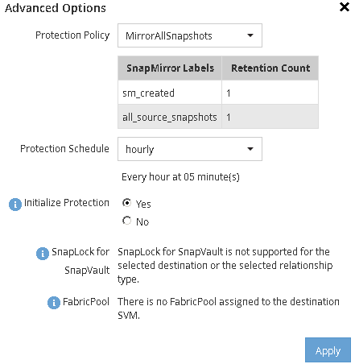
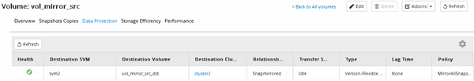

= Creating the SnapMirror relationship (starting with ONTAP 9.3)
:icons: font
:imagesdir: ../media/

[.lead]
You must create a SnapMirror relationship between the source volume on one cluster and the destination volume on the peered cluster for replicating data for disaster recovery.

* The destination aggregate must have available space.
* Both the clusters must be configured and set up appropriately to meet the requirements of your environment for user access, authentication, and client access.

You must perform this task from the *source* cluster.

. Click *Storage* > *Volumes*.
. Select the volume for which you want to create a mirror relationship, and then click *Actions* > *Protect*.
. In the *Relationship Type* section, select *Mirror* from the *Relationship Type* drop-down list.
. In the *Volumes: Protect Volumes* page, provide the following information:
 .. Select *Mirror* as the relationship type.
 .. Select the destination cluster, destination SVM, and the suffix for the name of the destination volume.
+
Only peered SVMs and allowed SVMs are listed under destination SVMs.

 .. Click image:../media/advanced_options_icon.gif[].
 .. In the *Advanced Options* dialog box, verify that `MirrorAllSnapshots` is set as the protection policy.
+
`DPDefault` and `MirrorLatest` are the other default protection policies that are available for SnapMirror relationships.

 .. Select a protection schedule.
+
By default, the `hourly` schedule is selected.

 .. Verify that *Yes* is selected for initializing the SnapVault relationship.
+
All of the data protection relationships are initialized by default. Initializing the SnapMirror relationship ensures that the destination volume has a baseline to start protecting the source volume.

 .. Click *Apply* to save the changes.
+

. Click *Save* to create the SnapMirror relationship.
. Verify that the relationship status of the SnapMirror relationship is in the `Snapmirrored` state.
 .. Navigate to the *Volumes* window, and then select the volume that the volume for which you created the SnapMirror relationship.
 .. Double-click the volume to view the volume details, and then click *PROTECTION* to view the data protection status of the volume.

+

You must make a note of the settings for the source volume such as thin provisioning, deduplication, compression, and autogrow. You can use this information to verify the destination volume settings when you break the SnapMirror relationship.
