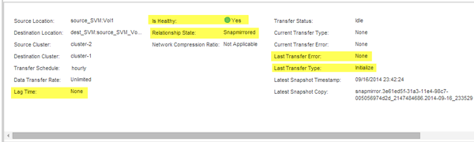

= Monitor the status of SnapMirror data transfers
:icons: font
:imagesdir: ../media/

[.lead]
You should periodically monitor the status of the SnapMirror relationships to ensure that the SnapMirror data transfers are occurring as per the specified schedule.

.About this task

You must perform this task from the *destination* cluster.

.Steps

. Depending on the System Manager version that you are running, perform one of the following steps:
 ** ONTAP 9.4 or earlier: Click *Protection* > *Relationships*.
 ** Starting with ONTAP 9.5: Click *Protection* > *Volume Relationships*.
. Select the SnapMirror relationship between the source and the destination volumes, and then verify the status in the *Details* bottom tab.
+
The Details tab displays the health status of the SnapMirror relationship and shows the transfer errors and lag time.

 ** The Is Healthy field must display `Yes`.
+
For most SnapMirror data transfer failures, the field displays `No`. In some failure cases, however, the field continues to display `Yes`. You must check the transfer errors in the Details section to ensure that no data transfer failure occurred.

 ** The Relationship State field must display `Snapmirrored`.
 ** The Lag Time must be no more than the transfer schedule interval.
+
For example, if the transfer schedule is hourly, then the lag time must not be more than an hour.

+
You should troubleshoot any issues in the SnapMirror relationships.
+
http://www.netapp.com/us/media/tr-4015.pdf[NetApp Technical Report 4015: SnapMirror Configuration and Best Practices for ONTAP 9.1, 9.2]
+

