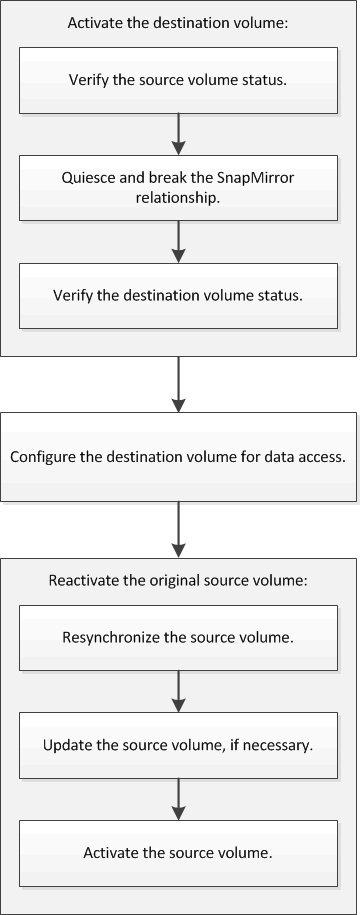

= Volume disaster recovery workflow
:icons: font
:imagesdir: ../media/

[.lead]
The volume disaster recovery workflow includes activating the destination volume, configuring the destination volume for data access, and reactivating the original source volume.

