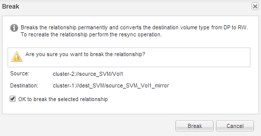
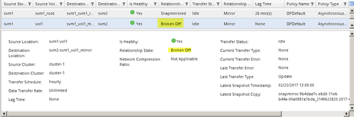

= Break the SnapMirror relationship
:icons: font
:imagesdir: ../media/

[.lead]
You must quiesce and break the SnapMirror relationship to activate the destination volume. After quiescing, future SnapMirror data transfers are disabled.

== Before you begin

The destination volume must be mounted on the destination SVM namespace.

== About this task

You must perform this task from the *destination* cluster.

== Steps

. Depending on the System Manager version that you are running, perform one of the following steps:
 ** ONTAP 9.4 or earlier: Click *Protection* > *Relationships*.
 ** Starting with ONTAP 9.5: Click *Protection* > *Volume Relationships*.
. Select the SnapMirror relationship between the source and the destination volumes.
. Click *Operations* > *Quiesce* to disable future data transfers.
. Select the confirmation check box, and then click *Quiesce*.
+
The quiesce operation might take some time; you must not perform any other operation on the SnapMirror relationship until the transfer status is displayed as `Quiesced`.

. Click *Operations* > *Break*.
. Select the confirmation check box, and then click *Break*.
+

+
The SnapMirror relationship is in `Broken Off` state.
+

