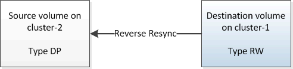
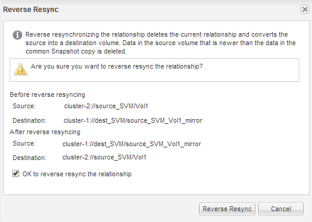

= Resynchronize the source volume
:icons: font
:imagesdir: ../media/

[.lead]
When the source volume is online, you must resynchronize the data between the destination volume and the source volume to replicate the latest data from the destination volume.

.Before you begin

The source volume must be online.

.About this task

You must perform the task from the *destination* cluster.

The following image shows that the data is replicated from the active destination volume to the read-only source volume:

.Steps

. Depending on the System Manager version that you are running, perform one of the following steps:
 ** ONTAP 9.4 or earlier: Click *Protection* > *Relationships*.
 ** Starting with ONTAP 9.5: Click *Protection* > *Volume Relationships*.
. Select the SnapMirror relationship between the source and destination volumes.
. Make a note of the transfer schedule and the policy configured for the SnapMirror relationship.
. Click *Operations* > *Reverse Resync*.
. Select the confirmation check box, and then click *Reverse Resync*.
+

+
Starting with ONTAP 9.3, the SnapMirror policy of the relationship is set to `MirrorAllSnapshots` and the mirror schedule is set to `None`.
+
If you are running ONTAP 9.2 or earlier, the SnapMirror policy of the relationship is set to `DPDefault` and the mirror schedule is set to `None`.

. On the source cluster, specify a SnapMirror policy and schedule that match the protection configuration of the original SnapMirror relationship:
 .. Depending on the System Manager version that you are running, perform one of the following steps:
  *** ONTAP 9.4 or earlier: Click *Protection* > *Relationships*.
  *** Starting with ONTAP 9.5: Click *Protection* > *Volume Relationships*.
 .. Select the SnapMirror relationship between the resynchronized source volume and the destination volume, and then click *Edit*.
 .. Select the SnapMirror policy and schedule, and then click *OK*.
