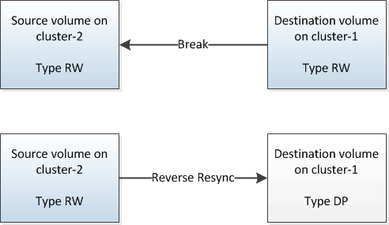
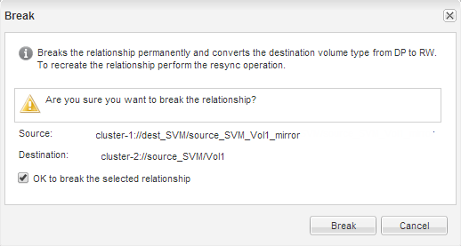
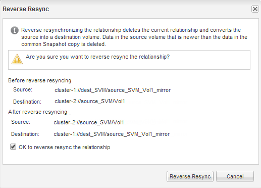

= Reactivate the source volume
:icons: font
:imagesdir: ../media/

[.lead]
After resynchronizing the data from the destination volume to the source volume, you must activate the source volume by breaking the SnapMirror relationship. You should then resynchronize the destination volume to protect the reactivated source volume.

== About this task

Both the break and reverse resync operations are performed from the *source* cluster.

The following image shows that the source and destination volumes are read/write when you break the SnapMirror relationship. After the reverse resync operation, the data is replicated from the active source volume to the read-only destination volume.

== Steps

. Depending on the System Manager version that you are running, perform one of the following steps:
 ** ONTAP 9.4 or earlier: Click *Protection* > *Relationships*.
 ** Starting with ONTAP 9.5: Click *Protection* > *Volume Relationships*.
. Select the SnapMirror relationship between the source and the destination volumes.
. Click *Operations* > *Quiesce*.
. Select the confirmation check box, and then click *Quiesce*.
. Click *Operations* > *Break*.
. Select the confirmation check box, and then click *Break*.
+

. Click *Operations* > *Reverse Resync*.
. Select the confirmation check box, and then click *Reverse Resync*.
+

+
Starting with ONTAP 9.3, the SnapMirror policy of the relationship is set to `MirrorAllSnapshots` and the SnapMirror schedule is set to `None`.
+
If you are running ONTAP 9.2 or earlier, the SnapMirror policy of the relationship is set to `DPDefault` and the SnapMirror schedule is set to `None`.

. Navigate to the source volume in the volumes page, and verify that the SnapMirror relationship you created is listed and the relationship state is `Snapmirrored`.
. On the destination cluster, specify a SnapMirror policy and schedule that match the protection configuration of the original SnapMirror relationship for the new SnapMirror relationship:
 .. Depending on the System Manager version that you are running, perform one of the following steps:
  *** ONTAP 9.4 or earlier: Click *Protection* > *Relationships*.
  *** Starting with ONTAP 9.5: Click *Protection* > *Volume Relationships*.
 .. Select the SnapMirror relationship between the reactivated source and the destination volumes, and then click *Edit*.
 .. Select the SnapMirror policy and schedule, and then click *OK*.

== Results

The source volume has read/write access and is protected by the destination volume.
