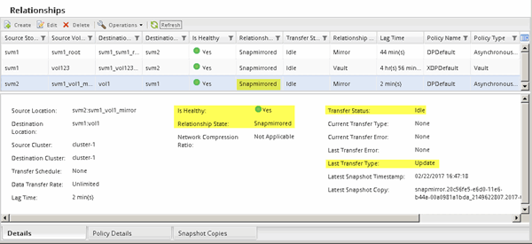

= Update the source volume
:icons: font
:imagesdir: ../media/

[.lead]
After resynchronizing the source volume, you might want to ensure that all the latest changes are updated on the source volume before activating the source volume.

.About this task

You must perform this task from the *source* cluster.

.Steps

. Depending on the System Manager version that you are running, perform one of the following steps:
 ** ONTAP 9.4 or earlier: Click *Protection* > *Relationships*.
 ** Starting with ONTAP 9.5: Click *Protection* > *Volume Relationships*.
. Select the SnapMirror relationship between the source and the destination volumes, and then click *Operations* > *Update*.
. Perform an incremental transfer from the recent common Snapshot copy between the source and destination volumes.
 ** Starting with ONTAP 9.3: Select the *As per policy* option.
 ** ONTAP 9.2 or earlier: Select the *On demand* option.
. Select *Limit transfer bandwidth to* in order to limit the network bandwidth used for transfers, and then specify the maximum transfer speed.
. Click *Update*.
. Verify that the transfer status is `Idle` and last transfer type is `Update` in the *Details* tab.
+

