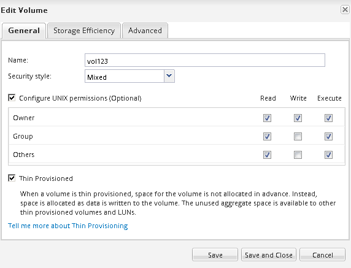
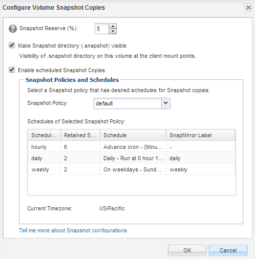

= Verifying the destination volume status
:icons: font
:imagesdir: ../media/

[.lead]
After breaking the SnapMirror relationship, you must verify that the destination volume has read/write access and that the destination volume settings match the settings of the source volume.

== About this task

You must perform this task from the *destination* cluster.

== Steps

. Navigate to the *Volumes* window.
. Select the destination volume from the *Volumes* list, and then verify that the destination volume type is `rw`, which indicates read/write access.
. Verify that the volume settings such as thin provisioning, deduplication, compression, and autogrow on the destination volume match the settings of the source volume.
+
You can use the volume settings information that you noted after creating the SnapMirror relationship to verify the destination volume settings.

. If the volume settings do not match, modify the settings on the destination volume as required:
 .. Click *Edit*.
 .. Modify the general settings, storage efficiency settings, and advanced settings for your environment, as required.
 .. Click *Save and Close*.
+

 .. Verify that the columns in the *Volumes* list are updated with the appropriate values.
. Enable Snapshot copy creation for the destination volume.
 .. Depending on your ONTAP version, navigate to the *Configure Volume Snapshot Copies* page in one of the following ways:
+
Starting with ONTAP 9.3: Select the destination volume, and then click *Actions* > *Manage Snapshots* > *Configure*.
+
ONTAP 9.2 or earlier: Select the destination volume, and then click *Snapshot Copies* > *Configure*.

 .. Select the *Enable scheduled Snapshot Copies* check box, and then click *OK*.

+

