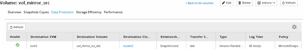
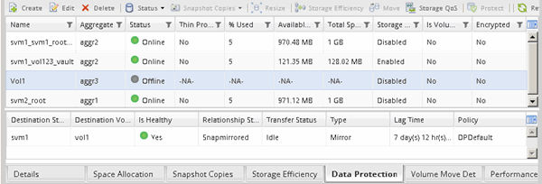

= Verify the status of the source volume
:icons: font
:imagesdir: ../media/

[.lead]
When the source volume is unavailable, you must verify that the source volume is offline and then identify the destination volume that must be activated for providing data access.

.About this task

You must perform this task from the *source* cluster.

.Steps

. Navigate to the *Volumes* window.
. Select the source volume, and then verify that the source volume is offline.
. Identify the destination volume in the SnapMirror relationship.
 ** Starting with ONTAP 9.3: Double-click the source volume to view the details, and then click *PROTECTION* to identify the destination volume in the SnapMirror relationship and the name of the SVM that contains the volume.
+

 ** ONTAP 9.2 or earlier: Click the *Data Protection* tab at the bottom of the Volumes page to identify the destination volume in the SnapMirror relationship and the name of the SVM that contains the volume.
+

