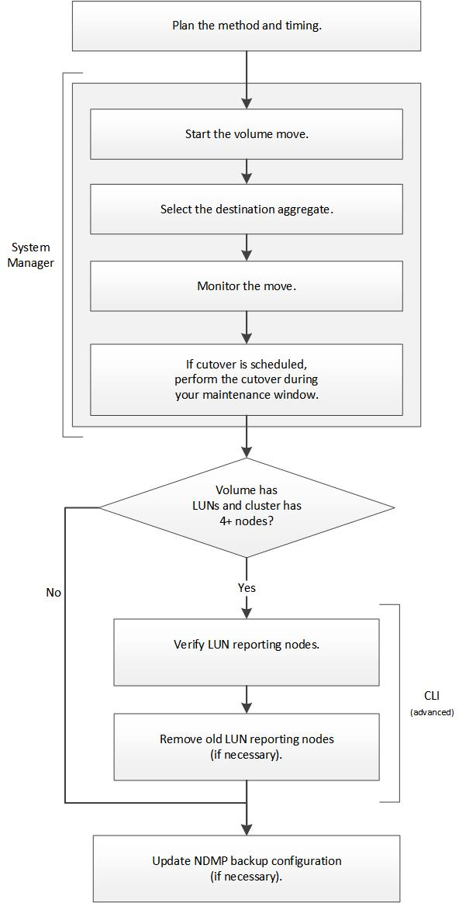

= Volume move workflow
:icons: font
:imagesdir: ../media/

[.lead]
Before moving a volume, you should select a method for the volume move operation and plan the timing of the operation. You can move a volume by using System Manager. After the move, you might have to update the NDMP backup configuration.

