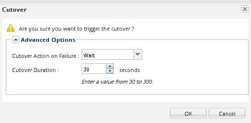

= Move a volume using System Manager
:icons: font
:imagesdir: ../media/

[.lead]
You can move a volume in System Manager by selecting a volume and the destination aggregate, starting the volume move operation, and optionally monitoring the volume move job. When using System Manager, a volume move operation finishes automatically.

== Before you begin

You should have reviewed the available space on the source aggregate and destination aggregate before the volume move operation and after the volume move operation.

== About this task

A volume move operation is supported only within the same cluster. In addition, you should note that the aggregate you are moving the volume to and the aggregate you are moving the volume from must be in the same storage virtual machine (SVM). A volume move does not disrupt client access.

== Steps

. Navigate to the *Volumes* window.
. Select the volume that you want to move, and then click *Actions* > *Move*.
. Select the destination aggregate, and then start the volume move operation:
 .. Select a destination aggregate from the list of possible aggregates, which includes only the aggregates that have the required capacity.
+
You should review the available space, total space, RAID type, and storage type of the aggregates. For example, if the goal is to alter the performance characteristics of the volume, you can focus on aggregates with the desired storage type.

 .. Click *Move*, and then click *Move* again to confirm that you want to proceed with the volume move operation.
+
When the Move Volume dialog box is displayed, leave the dialog box open if you want to monitor the volume move job.
. Monitor the volume move job:
 .. In the *Move Volume* dialog box, click the link to the *Job ID* of the volume move job.
 .. Locate the volume move job, and then review the information in the *Status* column.
+
The job can be in any one of several phases, such as transferring the initial baseline of data or starting a cutover attempt.
+
image::../media/volume_move_3_job_cutover.gif[This image is explained by the surrounding text.]

 .. Click *Refresh* in the *Jobs* window to view the updated job status.
+

+
The job status changes to `Complete: Successful` when the volume move operation finishes.
. If the volume move job enters the cutover deferred phase, perform a manual cutover.
 .. From the *Volumes* window, select the volume for which you initiated the volume move job.
 .. Initiate cutover for the volume:
+
|===
| If you are running...| Perform these steps...
a|
ONTAP 9.3 or later
a|

  ... Expand the volume and click the *Show More Details* link to view more information about the volume.
  ... In the Overview tab, click *Cutover*.

a|
ONTAP 9.2 or earlier
a|
In the *Volume Move Details* tab, click *Cutover*.
|===

 .. In the *Cutover* dialog box, click *Advanced Options* .
 .. Specify the cutover action and the cutover duration.
+

 .. Click *OK*.
. Repeat <<STEP_53CF9F368D034CAA9CE54A9416A0879C,Step 4>>.
