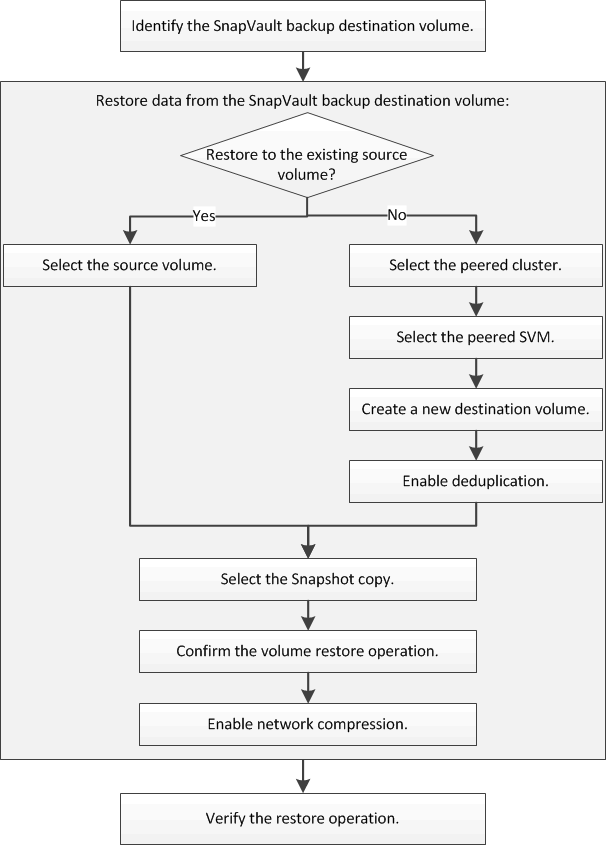

= Volume restore workflow
:icons: font
:imagesdir: ../media/

[.lead]
When your source volume is unavailable or data is corrupted, you can perform a restore from a SnapVault backup. Restoring a volume from a SnapVault backup involves selecting the SnapVault destination volume, restoring either to a new volume or existing volume, and verifying the restore operation.

