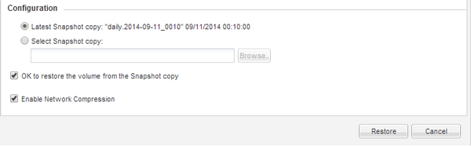

= Restoring data from a SnapVault backup
:icons: font
:imagesdir: ../media/

[.lead]
After selecting the SnapVault backup destination volume, you must perform the restore operation either to a new volume to test the backed-up data or to an existing volume to restore the lost or corrupted data.

You must perform this task from the *destination* cluster.

. Depending on the System Manager version that you are running, perform one of the following steps:
 ** ONTAP 9.4 or earlier: Click *Protection* > *Relationships*.
 ** Starting with ONTAP 9.5: Click *Protection* > *Volume Relationships*.
. Select the SVM that contains the SnapVault backup destination volume, and then click *Operations* > *Restore*.
. In the *Restore* dialog box, restore the data to the original source volume or a new volume:
+
|===
| If you want to restore to...| Then...
a|
The original source volume
a|
Select *Source volume*.
a|
A new volume
a|

 .. Select *Other volume*.
 .. Select the peered cluster and the peered SVM for the volume.
 .. Select a peered SVM from the list.
 .. If the SVM is not peered, create the SVM peer relationship:
  ... Select the SVM.
  ... Click *Authenticate*.
  ... Enter the cluster administrator's credentials of the peered cluster, and then click *Create*.
 .. Select *New Volume*.
 .. If you want to change the default name, displayed in the format `destination_SVM_name_destination_volume_name_restore`, specify a new name and select the containing aggregate for the volume.
 .. Select the *Enable dedupe* check box.

+
|===
image:../media/restore_to.gif[Selecting the volume to restore]

. Select either the latest Snapshot copy or select a specific Snapshot copy that you want to restore.
. Select the *OK to restore the volume from the Snapshot copy* check box.
. Select the *Enable Network Compression* check box to compress the data that is being transferred during the restore operation.
. Click *Restore*.
+
During the restore process, the volume being restored is changed to read-only. After the restore operation finishes, the temporary relationship is removed and the restored volume is changed to read/write.
+

. Click *OK* in the message box.
